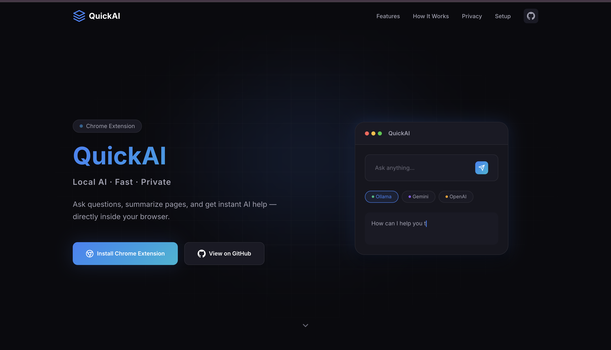

# QuickAI Landing Website

A modern, responsive, production-ready landing website for the QuickAI Chrome extension.

## 📸 Screenshots



## 📁 Project Structure

```
QuickAi Web/
├── index.html          # Main HTML file
├── css/
│   └── styles.css      # All styles
├── js/
│   └── main.js         # JavaScript functionality
├── assets/
│   ├── favicon.svg     # Site favicon
│   └── og-image.svg    # Open Graph image for social sharing
└── README.md           # This file
```

## 🛠️ Technologies Used

- **HTML5** - Semantic markup
- **CSS3** - Custom properties, Flexbox, Grid, animations
- **Vanilla JavaScript** - No frameworks required
- **Google Fonts** - Inter font family

### Links

- Chrome Web Store URL (search for `https://chromewebstore.google.com/detail/quickai/pglbifcfjpidnmjnkjkghbkiihmjgfjg`)
- Website URL (search for `https://quickai-website.vercel.app/`)

## 📱 Browser Support

- Chrome 88+
- Firefox 78+
- Safari 14+
- Edge 88+

## 📄 License

MIT License - feel free to use this template for your projects!

---

**Built for QuickAI** - Local AI · Fast · Private
